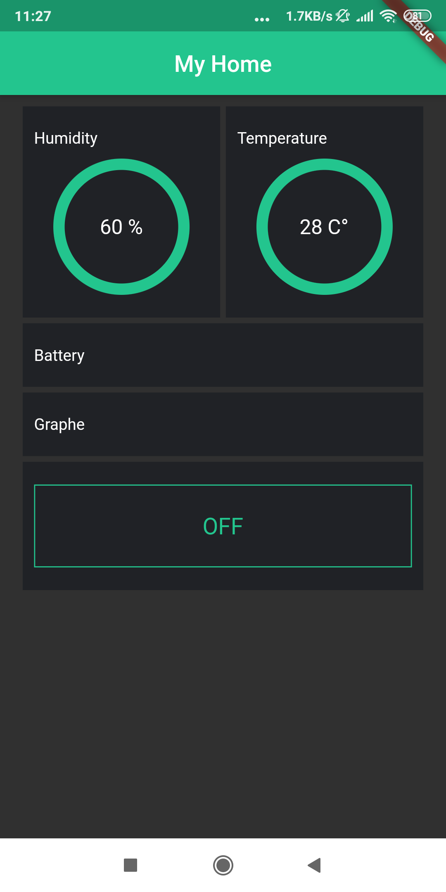

# WeatherAppEsp8266

A weather station app that collect data from dht11 sensor using the esp8266
.

## Screenshots:

### App :

### On BreadBoard :

### Circuit scheme :

## Description:

This app help showing the status of the temperature and humidity sensor .

## TODO:

- Add battery life status ( when supplying with battery in case of an outside study ).

- Add graphical plot of the temperature and humidity data .

- Adding sleep mode on/off .

## Tools used:

- uPyCraft_V1.1

* Android Studio

## Hardware Used :

- esp8226 ( NodeMcu Board )
